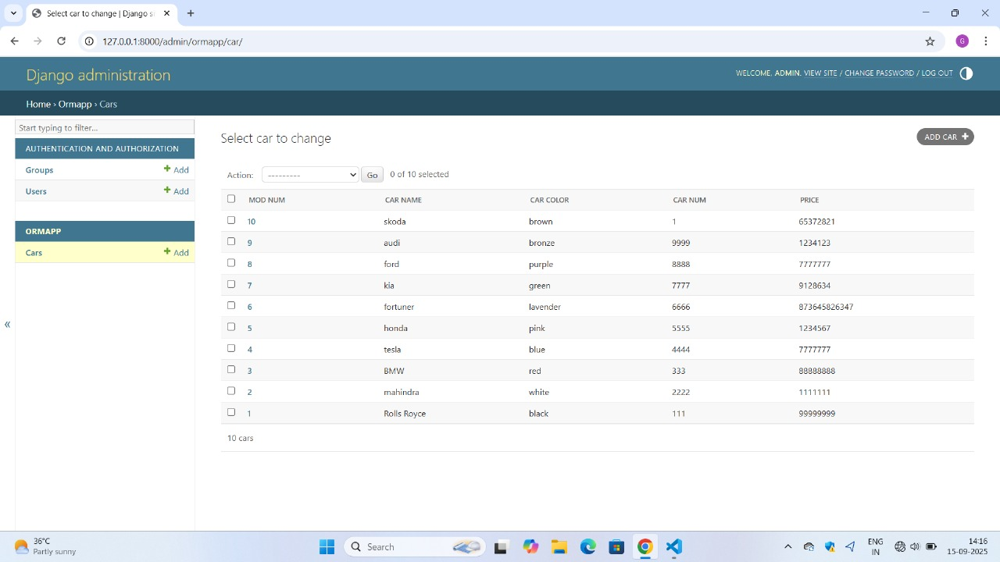

# Ex02 Django ORM Web Application
## Date: 15.09.2025

## AIM
To develop a Django application to store and retrieve data from a Car Inventory Database using Object Relational Mapping(ORM).


## DESIGN STEPS

### STEP 1:
Clone the problem from GitHub

### STEP 2:
Create a new app in Django project

### STEP 3:
Enter the code for admin.py and models.py

### STEP 4:
Execute Django admin and create details for 10 books

## PROGRAM
```
models.py

from django.db import models
from django.contrib import admin
class owner(models.Model):
    mod_num=models.CharField(max_length=10)
    car_no=models.IntegerField(primary_key=True)
    car_name= models.CharField(max_length=10)
    price=models.IntegerField()
    car_colour=models.CharField(max_length=10)
class ownerAdmin(admin.ModelAdmin):
    list_display=["mod_num","car_name","car_colour","car_no","price"]

admin.py

from django.contrib import admin
from.models import car,carAdmin
admin.site.register(car,carAdmin)

```
## OUTPUT



## RESULT
Thus the program for creating car inventory database database using ORM hass been executed successfully
